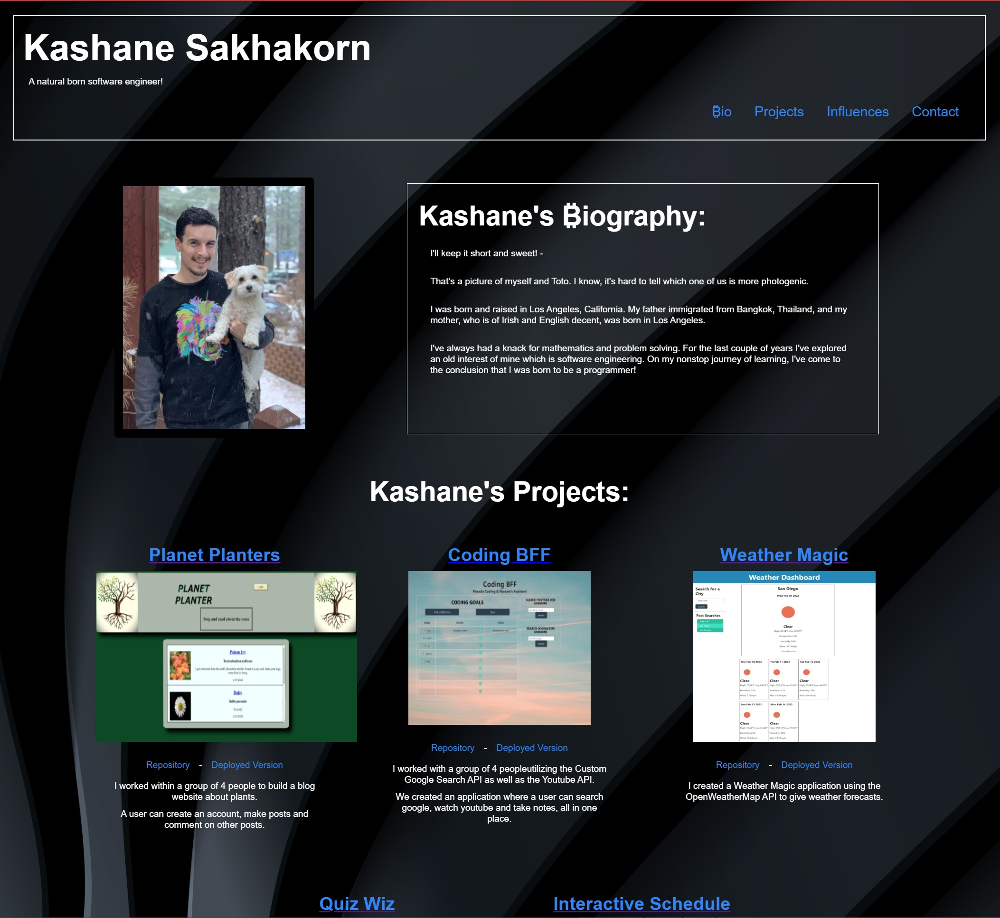

Kashane Sakhakorn's Portfolio:
=======
[My Portfolio](https://kashane1.github.io/portfolio/)
-----------
Following the link above will bring you to my portfolio that I have begun to create for my career as a software engineer.

-----------
Requirements:
-----------

1. My portfolio contains my name, a recent photo, and links to sections about me, my work, and how to contact me.
2. The navigation links to corresponding sections on the page
3. My work has project titles with images of my most recent applications
4. My first application is larger than the others
5. Each image of the application can be clicked on to deploy that application
6. The page can be resized and the layout will adapt to the viewport
7. Finally I've kept my portfolio up to date with my current projects

-----------
Process:
-----------
I enjoyed updating my portfolio as time passed. I could really feel the changes in my coding abilities. It was fun to see how far I've come since the beginning of my coding journey. I am also well aware of how much farther I will take this skillset. This still feels very elementary compared to the things I know I will accomplish in this career. The best is yet to come.

-----------
```
preview of my portfolio:
```


-----------
Cited:
-----------
https://www.w3schools.com/ - references to html and css

https://developer.mozilla.org/en-US/ - javascript and jquery help

https://stackoverflow.com/questions - for those hard to find answers

-----------